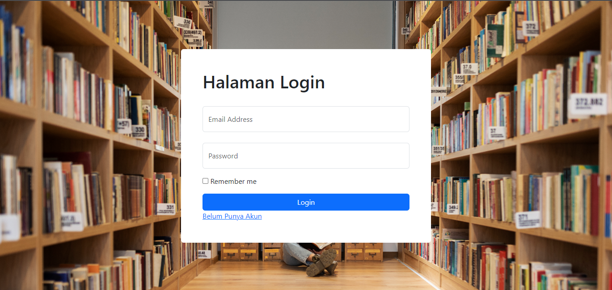
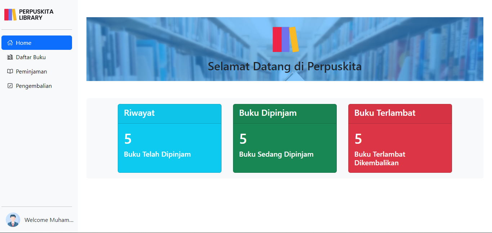
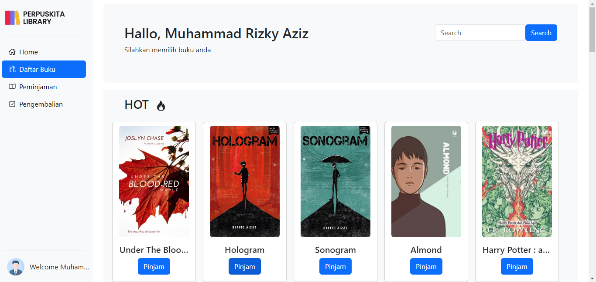
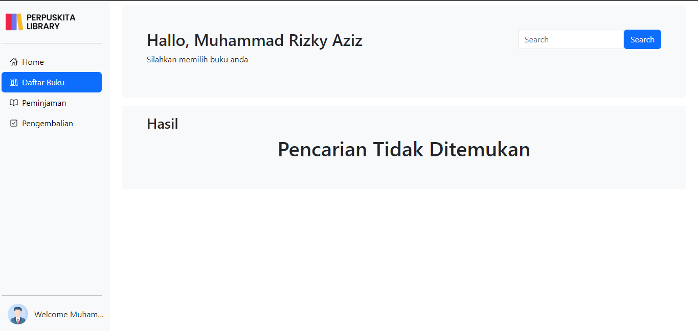

# Nama Lengkap Mahasiswa
Nama  : Muhammad Rizky Aziz

NIM   : 22/499420/SV/21321

# Penjelasan Website Secara Umum
Perpuskita merupakan sebuah website yang dapat digunakan sebagai Sistem Informasi Perpustakaan yang bersifat mandiri. Sebab, dengan adanya website perpuaskita maka, pengunjung perpustakaan dapat melakukan kegiatan peminjaman/pengembalian secara mandiri (self service)

### Tujuan
Tujuan awal dibuatnya website ini adalah untuk mengurangi ketergantuin pengunjung kepada pengawas atau petugas penjaga perpustakaan untuk melakukan kegiatan meminjam atau mengembalikan buku


### Permasalahan yang Dicover
Perpuskita dapat meng-cover masalah masalah primer dalam penggunaanya :

1. Antrian : Dengan menggunakan perpuskita pengunjug tidak harus antri di depan counter hanya untuk meminjam buku atau mengembalikan buku
2. Kesulitan Mencari Buku : Dengan menggunakan perpuskita tentu saja pengunjung akan langsung dapat mencari buku yang mereka inginkan tanpa harus mengelilingi bangunan perpustakaan
3. Data yang dinamis : Penyimpanan data secara digital akan jauh lebih efisien dan juga sangat memudahkan bagi petugas maupun bagi pengunjung untuk mengorganisirnya

# Kriteria Penilaian (4 Requirement Dasar)
### Desain rapi mengikuti kaidah atau prinsip desain
Desain yang rapi merupakan sebuah hal yang subjektif, sehingga mungkin penilaian saya dengan orang lain berbeda. namun saya telah berusaha untuk membuat desain yang rapi seperti contoh dibawah ini

<br>

<br>

<br>


### Website responsive, dapat diakses melalui device
Perpuskita merupakan website yang dinamis sehingga halaman tidak akan berantakan ketika dibuka melalui device mobile. berikut conton code yang membuat website ini dinamis :

```
@media (min-width: 768px) {
    .sidebar {
      height: 100vh;
    }
}
```

kode di atas akan membuat sidebar memiliki tinggi seukuran dengan tinggi layar jika dibuka di layar yang memiliki lebar diatas 768px

```
<div class="col-8 col-md-10 card text-white bg-info m-3">
```

kode di atas akan meruba ukuran daru container. col-8 akan menjadi default ukuranya, sedangkan jika layar medium(768px atau lebih) maka ukuran container akan menjadi col-10

### Direct feedback ke pengguna website

website ini juga dapat memberikan feedback langsung kepada pengguna dengan contoh kode sebagai berikut : 

```
<script>
      var tidakDitemukan = <?php echo json_encode($tidakDitemukan); ?>;

      if (tidakDitemukan) {
        var divElem = document.getElementById('tidakDitemukan');
        divElem.insertAdjacentHTML('afterbegin', '<h1 id="elemenID" class="text-center">Pencarian Tidak Ditemukan</h1>');
      }

</script>
```

variabel $tidakDitemukan akan bernilai true jika query search yang telah dilakukan memiliki baris <= 0 sehingga jika query tersebut tidak menemukan apa apa maka javascript akan menampilkan elemen seperti yang telah ditulis

<br>

gambar diatas adalah tampilan dari kode yang dijelaskan

### Konten dinamis dari database
untuk melakukan penampilan data buku website ini telah menggunakan konten dinamis dengan kode sebagai berikut :
```
$query = "SELECT b.id_buku, b.judul_buku, b.id_gambar FROM daftar_buku b JOIN hot h ON b.id_buku = h.id_buku;";
$result = mysqli_query($connection, $query);

$books = array();

while ($row = mysqli_fetch_assoc($result)) {
    $books[] = $row;
}
```
kode di atas adalah algoritma menampilkan semua buku yang sedang HOT dengan cara menampilkan semua buku yang ada pada Join antara daftar_buku dengan hot tabel.

```
<?php foreach ($books as $book): ?>
<div class="card card-buku text-center mt-3 mx-2">
" alt="...">
<div class="card-body">
    <h5 class="card-title text-truncate"><?php echo $book['judul_buku']; ?></h5>
    <form method="POST" action="../Peminjaman/peminjaman.php">
        <input type="hidden" name="pinjam" value="<?php echo $book['id_buku']; ?>">
        <button class="btn btn-primary" type="submit">Pinjam</button>
    </form>
</div>
</div>
<?php endforeach; ?>
```
setelah semua buku didapat dan disimpan di dalam array makan akan ada perulangan dengan foresearch sehingga seluruh buku ditampilkan pada elemen div di atas

